# Atari A8 Cartridge

[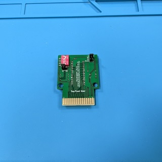](images/Cartridge_Front.jpg?raw=1)
[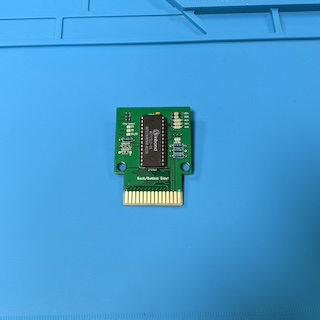](images/Cartridge_Back.jpg?raw=1)
[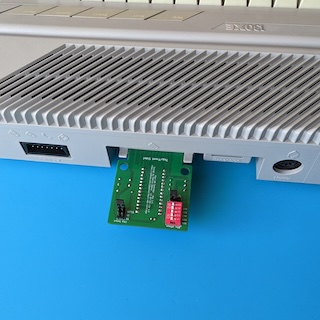](images/Cartridge_in_Slot.jpg?raw=1)

This repository contains the KiCad project and Gerber files for a simple
cartridge for the Atari 8-Bit Computers (Atari 400/800/XL/XE/XEGS). It supports
8 KiB and 16 KiB cartridge images that do not need memory mappers. You may put
multiple cartridge images on one cartridge, and select which one of the images
to start by using DIP switches, pin headers and jumpers.

## Ordering the PCB

The subdirectory "gerber-files" contains a Zip file you can use to order the PCB
from PCB manufacturers like PCBWay or JLCPCB. Simply upload the Zip on their web
page. Order the standard PCB thickness of 1.6mm. I also recommend to order a
surface finish of ENIG with gold fingers and chamfered edges, because it is much
more durable than the default HASL finish.

## Building the Cartridge

### Bill of Materials

* __1x 27(C)512 / 27(C)256 / 27(C)128 / 27(C)64 EPROM__.

  This is where you store your cartridge images. 27(C)512 have a capacity of 64
  KiB, 27(C)256 have 32 KiB, 27(C)128 have 16 KiB, and 27(C)64 have 8 KiB.

* (Optional) __1x 28 Pin Socket 2.54mm pitch 15.42mm width__.

  This is the socket for the EPROM. It is optional, you can also solder the
  EPROM directly to the PCB, but I prefer to use sockets. Keep in mind that the
  cartridge will not fit into a cartridge shell when you use sockets.

* __1x Ceramic Capacitor 100nF 2.5mm pitch__.

  This is the blocking capacitor for the EPROM.

* (Optional) __4x 10 kOhm Resistors DIN 0207__.

  These are pull-up resistors. Three of them are used on the DIP switches for
  the address lines A13, A14 and A15. When you do not plan to use the DIP
  switches, you can leave them away. The last one of the resistors is used to
  create the Chip Select (CS)
  signal for the EPROM when using 16 KiB ROMs. When you do not plan to use 16
  KiB ROMs, you can leave that resistor away.

* (Optional) __2x Diodes 1N4148 DO-35__.

  These are switching diodes used to create the Chip Select
  (CS) signal for the EPROM when
  using 16 KiB ROMs. When you do not plan to use 16 KiB ROMs, you can leave
  these diodes away.

* (Optional) __1x 1x3 Pin Header 2.54mm pitch__.

  Used to switch between 8 KiB and 16 KiB ROMs. When you do not need to switch
  between 8 KiB and 16 KiB ROMs, you can leave this pin header away and select
  a static configuration with a solder jumper.

* (Optional) __1x 2x3 Pin Header 2.54mm pitch__.

  Used to select the signal that goes to the Chip Select
  (CS) pin of the EPROM. This pin
  header is optional, you can select a static configuration with a solder
  jumper.

* (Optional) __2x Jumpers 2.54mm pitch__.

  Used on the pin headers to select the signal that goes to the Chip Select
  (CS) pin of the EPROM as well
  as to switch between 8 KiB and 16 KiB ROMs.

### Soldering the Pull-up Resistors on the Address Lines

We start with soldering the three pull-up resistors on the DIP switches that
control the address lines A13, A14 and A15. These are optional - when you do not
plan to use the DIP switches, you can leave these three resistors away.

[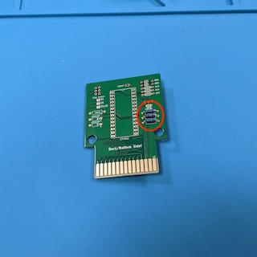](images/Soldering_Address_Pullups.jpg?raw=1)

### Soldering the Pull-up Resistor and Diodes for the 16 KiB Chip Select Signal

Then, we solder the single pull-up resistor and the two diodes that generate the
Chip Select (CS) signal for 16 KiB
ROMs. These are also optional - when you do not plan to use 16 KiB ROMs, you can
leave the resistor and the diodes away.

[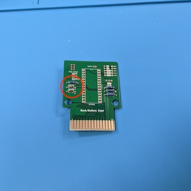](images/Soldering_Diodes.jpg?raw=1)

### Soldering the EPROM Socket

Now we solder the EPROM socket. This socket is optional, you can also solder the
EPROM directly to the cartridge, but I prefer sockets. Keep in mind that the
EPROM in a socket does not fit any cartridge case!

When soldering the EPROM directly to the cartridge, of course you have to fill
it with data before doing so!

Make sure that the notch of the socket points into the direction marked on the
silk screen of the PCB (up in the image below).

[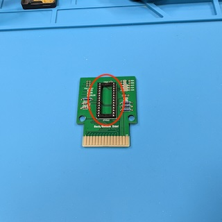](images/Soldering_Socket.jpg?raw=1)

### Soldering the Capacitor

Next, solder the blocking capacitor to the cartridge.

[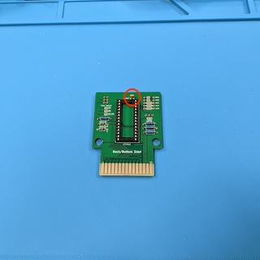](images/Soldering_Capacitor.jpg?raw=1)

### Soldering the Pin Header for the Chip Select Signal

Next, we solder the pin header used to configure the Chip Select
(CS) signal. More in detail
information about the configuration of the cartridge using these pin headers is
available in the section [Using the Cartridge](#using-the-cartridge) below.

Using the pin headers is optional, you can also generate a static configuration
by using corresponding solder jumpers on the back of the cartridge. Keep in mind
that you will not be able to put the cartridge into a case when you use the pin
headers!

[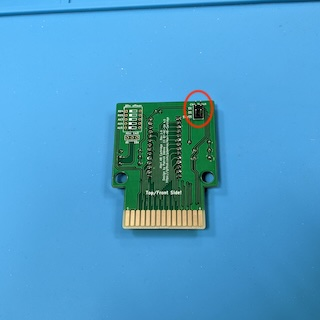](images/Soldering_PinHeader_CS.jpg?raw=1)
[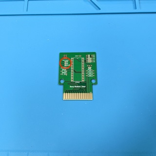](images/Jumpers_CS.jpg?raw=1)

### Soldering the DIP Switch

Now, we solder the DIP switch used to configure the RD4 and RD5 signals of the
cartridge as well as the address lines A13, A14 and A15 of the EPROM. You should
orient the DIP switch so that the "on" position of the sliders is to the right
of the cartridge as shown in the image below.

Using the DIP switch is optional, you can also generate a static configuration
by using corresponding solder jumpers on the back of the cartridge. Keep in mind
that you will not be able to put the cartridge into a case when you use the DIP
switch.

[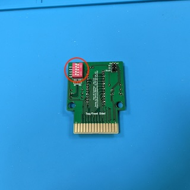](images/Soldering_DIP_Switch.jpg?raw=1)
[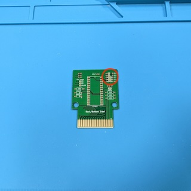](images/Jumpers_Address_Lines.jpg?raw=1)

### Soldering the Pin Header for Selecting 8 KiB or 16 KiB Cartridge ROMs 

Next, we solder the pin header used to configure the cartridge for 8 KiB or 16
KiB ROMs.

Using the pin headers is optional, you can also generate a static configuration
by using corresponding solder jumpers on the back of the cartridge. Keep in mind
that you will not be able to put the cartridge into a case when you use the pin
headers!

[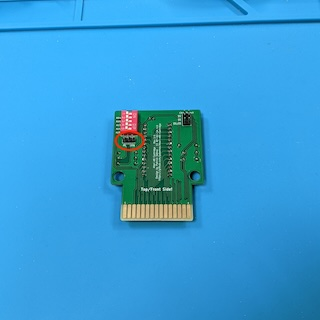](images/Soldering_PinHeader_8k_16k.jpg?raw=1)
[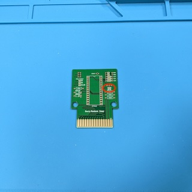](images/Jumpers_8k_16k.jpg?raw=1)

### Using the Cartridge

This section explains how to use the cartridge, i.e. how to burn one or more
cartridge images onto the EPROM, and how to configure the cartridge to start one
of the images. There are DIP switches and two pin headers on the cartridge for
configuration. Two of the DIP switches configure the RD4 and RD5 signal lines of
the cartridge, i.e. they tell the computer where in the address space the
cartridge should show up. The remaining DIP switches configure the address lines
A13, A14, and A15, i.e. they determine the location of the ROM file on the
EPROM. One of the pin headers configures the Chip Select
(CS) signal of the EPROM, and the
other pin header configures the cartridge for 8 KiB or 16 KiB ROMs. When you do
not need the flexibility of configuring the cartridge using DIP switches or pin
headers and jumpers, there are corresponding solder jumpers on the back of the
cartridge that you can use to create a fixed configuration using solder blobs.

You do not need to worry if your configuration is correct, neither the cartridge
nor you Atari computer can be damaged by a wrong configuration, it simply will
not work.

> [!WARNING]
> Never change the configuration while the Atari computer is running. Always
> switch off the computer before changing the configuration or plugging in or
> removing the cartridge from the computer, otherwise you may damage the
> cartridge or your computer.

There are three types of ROMs supported by this cartridge:

  1. 8 KiB ROMs that get mapped at address range 32768-40959 ($8000-$9fff). This
     type of ROM is almost never used.
  2. 8 KiB ROMs that get mapped at address range 40960-49151 ($a000-$bfff).
  3. 16 KiB ROMs that get mapped at address range 32768-49151 ($8000-$bfff).

The following table show the settings used to configure the cartridge for these
three types of ROMs (and a fourth configuration which disables the cartridge).
You have to set the RD4 and RD5 DIP switches, connect the top, middle or bottom
two pins of the 2x3 pin header for the Chip Select signal, and you have to
connect either the left two or the right two pins of the 3x1 pin header for the
8 KiB / 16 KiB ROM size:

| RD4 / RD5 | Chip Select | ROM Size | Meaning |
|-----------|-------------|----------| --------|
| <picture><source media="(prefers-color-scheme: dark)" srcset="images/rd4_off_rd5_off.dark.svg"></picture> | Does not matter | Does not matter | Cartridge is disabled |
| <picture><source media="(prefers-color-scheme: dark)" srcset="images/rd4_on_rd5_off.dark.svg"></picture> | <picture><source media="(prefers-color-scheme: dark)" srcset="images/CS_S4.dark.svg"></picture> | <picture><source media="(prefers-color-scheme: dark)" srcset="images/8k.dark.svg"></picture> | 8 KiB cartridge at address range 32768-40959 ($8000-$9fff) |
| <picture><source media="(prefers-color-scheme: dark)" srcset="images/rd4_off_rd5_on.dark.svg"></picture> | <picture><source media="(prefers-color-scheme: dark)" srcset="images/CS_S5.dark.svg"></picture> | <picture><source media="(prefers-color-scheme: dark)" srcset="images/8k.dark.svg"></picture> | 8 KiB cartridge at address range 40960-49151 ($a000-$bfff) |
| <picture><source media="(prefers-color-scheme: dark)" srcset="images/rd4_on_rd5_on.dark.svg"></picture> | <picture><source media="(prefers-color-scheme: dark)" srcset="images/CS_S4_S5.dark.svg"></picture> | <picture><source media="(prefers-color-scheme: dark)" srcset="images/16k.dark.svg"></picture> | 16 KiB cartridge at address range 32768-49151 ($8000-$bfff) |

All other configurations not shown in the above table are invalid!

The remaining three DIP switches for the address lines A13, A14 and A15
determine the location of the ROM on the EPROM. Moving a DIP switch to the right
sets the corresponding address line to logic "0", and moving the switch to the
left sets the address line to "1". The cartridge supports 27(C)512, 27(C)256,
27(C)128, and 27(C)64 EPROMs which have different capacities and can store
different numbers of ROMs.

On 27(C)512 EPROMs with 64 KiB capacity, there are 8 slots where you may put ROM
images. 8 KiB ROMs require one single slot and may start at any of these slots,
16 KiB ROMs require two slots and must start at slots 1, 3, 5 or 7. You can
arbitrarily mix different image sizes to fill the available space. The following
table shows all possible combinations:

| Address Lines | Meaning |
|---------------|---------|
| <picture><source media="(prefers-color-scheme: dark)" srcset="images/slot1.dark.svg"></picture> | Slot 1 at address range 0-8191 ($0-$1fff) |
| <picture><source media="(prefers-color-scheme: dark)" srcset="images/slot2.dark.svg"></picture> | Slot 2 at address range 8192-16383 ($2000-$3fff) |
| <picture><source media="(prefers-color-scheme: dark)" srcset="images/slot3.dark.svg"></picture> | Slot 3 at address range 16384-24575 ($4000-$5fff) |
| <picture><source media="(prefers-color-scheme: dark)" srcset="images/slot4.dark.svg"></picture> | Slot 4 at address range 24576-32767 ($6000-$7fff) |
| <picture><source media="(prefers-color-scheme: dark)" srcset="images/slot5.dark.svg"></picture> | Slot 5 at address range 32768-40959 ($8000-$9fff) |
| <picture><source media="(prefers-color-scheme: dark)" srcset="images/slot6.dark.svg"></picture> | Slot 6 at address range 40960-49151 ($a000-$bfff) |
| <picture><source media="(prefers-color-scheme: dark)" srcset="images/slot7.dark.svg"></picture> | Slot 7 at address range 49152-57343 ($c000-$dfff) |
| <picture><source media="(prefers-color-scheme: dark)" srcset="images/slot8.dark.svg"></picture> | Slot 8 at address range 57344-65535 ($e000-$ffff) |

On 27(C)256 EPROMs with 32 KiB capacity, there are 4 slots where you may put ROM
images. 8 KiB ROMs require one single slot and may start at any of these slots,
16 KiB ROMs require two slots and must start at slots 1 or 3. You can
arbitrarily mix different image sizes to fill the available space. A15 must
always be set to logical "1" on these EPROMs. The following table shows all
possible combinations:

| Address Lines | Meaning |
|---------------|---------|
| <picture><source media="(prefers-color-scheme: dark)" srcset="images/slot5.dark.svg"></picture> | Slot 1 at address range 0-8191 ($0-$1fff) |
| <picture><source media="(prefers-color-scheme: dark)" srcset="images/slot6.dark.svg"></picture> | Slot 2 at address range 8192-16383 ($2000-$3fff) |
| <picture><source media="(prefers-color-scheme: dark)" srcset="images/slot7.dark.svg"></picture> | Slot 3 at address range 16384-24575 ($4000-$5fff) |
| <picture><source media="(prefers-color-scheme: dark)" srcset="images/slot8.dark.svg"></picture> | Slot 4 at address range 24576-32767 ($6000-$7fff) |

On 27(C)128 EPROMs with 16 KiB capacity, there are 2 slots where you may put ROM
images. 8 KiB ROMs require one single slot and may start at any of these slots,
16 KiB ROMs require two slots and must start at slot 1. A14 and A15 must always
be set to logical "1" on these EPROMs. The following table shows all possible
combinations:

| Address Lines | Meaning |
|---------------|---------|
| <picture><source media="(prefers-color-scheme: dark)" srcset="images/slot7.dark.svg"></picture> | Slot 1 at address range 0-8191 ($0-$1fff) |
| <picture><source media="(prefers-color-scheme: dark)" srcset="images/slot8.dark.svg"></picture> | Slot 2 at address range 8192-16383 ($2000-$3fff) |

On 27(C)64 EPROMs with 8 KiB capacity, there is one single slot where you may put
one single 8 KiB ROM. A13, A14 and A15 must always be set to logical "1" on
these EPROMs. The following table shows the only possible combination:

| Address Lines | Meaning |
|---------------|---------|
| <picture><source media="(prefers-color-scheme: dark)" srcset="images/slot8.dark.svg"></picture> | Slot 1 at address range 0-8191 ($0-$1fff) |

#### Example

In this section I will demonstrate how to burn two 8 KiB cartridge images and
two 16 KiB cartridge images onto a 27(C)512 EPROM using the popular TL866
programmer and its Xgpro software. I selected the following images:

* The "Atari 65/130 XE Rev. 3.4 Test Cartridge", a 8 KiB ROM that I put into
  slot 1 of the cartridge.
* The game "Galaxian", a 8 KiB ROM that I put into slot 2 of the cartridge.
* The game "Donkey Kong", a 16 KiB ROM that I put into slots 3 and 4 of the
  cartridge.
* The game "Pac Man", a 16 KiB ROM that I put into slots 5 and 6 of the
  cartridge.

The last 16 KiB of the EPROM will stay empty for now.

In the software of my programmer we select the correct EPROM (a Winbond
W27C512 in my case). First, we have to program the 8 KiB image for the Atari
Test Cartridge. In the file selection dialog, we select the cartridge file
("65-130XE_Diagnostic_Cartridge_3.4.car"). This is a "car" file that has an
additional header of 16 bytes in front of the actual ROM image that we have to
remove. In the "Load mode" box, we set the "From File Start Addr(Hex)" to
"00010", which is the hexadecimal notation of decimal 16, and the "TO Buffer
Strat Addr(HEX)" (there actually is a typo in the software ) to "00000". So we
load the image without the 16 byte header to the first slot of the EPROM.

[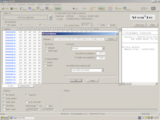](images/Xgpro_Program_Slot1.png?raw=1)

Now, we have to load the 8 KiB image of Galaxian into the second slot of the
EPROM. In the file selection dialog, we select the image file "Galaxian
(1982)(Atari)(US).bin". This is the raw image data without any header. In the
"Load mode" box, we set the "From File Start Addr(Hex)" to "00000", and the "TO
Buffer Strat Addr(HEX)" to "02000", which is the hexadecimal notation of decimal
8192. Now, we have to switch the "Clear Buffer when loading the file" selection
box to "disable", otherwise we will loose the data we loaded in the previous
step.

Next, we have to load the 16 KiB image of Donkey Kong into the third and fourth
slots of the EPROM. In the file selection dialog, we select the image file
"Donkey Kong.rom". This also is a raw image without a header. In the "Load
mode" box, we set the "From File Start Addr(Hex)" to "00000", and the "TO Buffer
Strat Addr(HEX)" to "04000", which is the hexadecimal notation of decimal 16384.
Again, we have to switch the "Clear Buffer when loading the file" selection box
to "disable" to prevent clearing the data from the previous steps.

[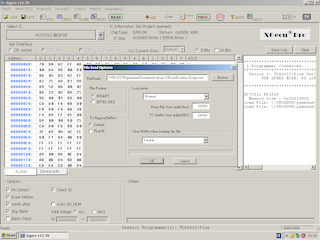](images/Xgpro_Program_Slot3_Slot4.png?raw=1)

Last, we have to load the 16 KiB image of Pac Man into the fifth and sixth
slots of the EPROM. In the file selection dialog, we select the image file
"pacman.rom". Again this is a raw image without a header. In the "Load mode"
box, we set the "From File Start Addr(Hex)" to "00000", and the "TO Buffer Strat
Addr(HEX)" to "08000", which is the hexadecimal notation of decimal 32768.
We have to switch the "Clear Buffer when loading the file" selection box to
"disable" to prevent clearing the data from the previous steps.

[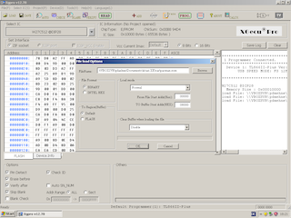](images/Xgpro_Program_Slot5_Slot6.png?raw=1)

Now we are finished with loading the image files. We burn the data to the EPROM
and put the EPROM onto the cartridge with the notch of the EPROM pointing into
the direction marked onto the silk screen. The following table shows the
settings we need to make to use the ROM images:

| RD4 / RD5 | Chip Select | ROM Size | Address Lines | ROM Image |
|-----------|-------------|----------| --------------|-----------|
| <picture><source media="(prefers-color-scheme: dark)" srcset="images/rd4_off_rd5_on.dark.svg"></picture> | <picture><source media="(prefers-color-scheme: dark)" srcset="images/CS_S5.dark.svg"></picture> | <picture><source media="(prefers-color-scheme: dark)" srcset="images/8k.dark.svg"></picture> | <picture><source media="(prefers-color-scheme: dark)" srcset="images/slot1.dark.svg"></picture> | 65/130 XE Test |
| <picture><source media="(prefers-color-scheme: dark)" srcset="images/rd4_off_rd5_on.dark.svg"></picture> | <picture><source media="(prefers-color-scheme: dark)" srcset="images/CS_S5.dark.svg"></picture> | <picture><source media="(prefers-color-scheme: dark)" srcset="images/8k.dark.svg"></picture> | <picture><source media="(prefers-color-scheme: dark)" srcset="images/slot2.dark.svg"></picture> | Galaxian |
| <picture><source media="(prefers-color-scheme: dark)" srcset="images/rd4_on_rd5_on.dark.svg"></picture> | <picture><source media="(prefers-color-scheme: dark)" srcset="images/CS_S4_S5.dark.svg"></picture> | <picture><source media="(prefers-color-scheme: dark)" srcset="images/16k.dark.svg"></picture> | <picture><source media="(prefers-color-scheme: dark)" srcset="images/slot3.dark.svg"></picture> | Donkey Kong |
| <picture><source media="(prefers-color-scheme: dark)" srcset="images/rd4_on_rd5_on.dark.svg"></picture> | <picture><source media="(prefers-color-scheme: dark)" srcset="images/CS_S4_S5.dark.svg"></picture> | <picture><source media="(prefers-color-scheme: dark)" srcset="images/16k.dark.svg"></picture> | <picture><source media="(prefers-color-scheme: dark)" srcset="images/slot5.dark.svg"></picture> | Pac Man |

#### Putting the Cartridge into an Atari 8-Bit Machine

> [!WARNING]
> Before sticking the cartridge into your Atari, make sure the computer is
> switched off, otherwise you might damage either the computer or the cartridge!

Set the right configuration of the RD4/RD5 signals, the Chip Select
(CS) signal, the ROM size (8 or 16
KiB), and the A13, A14 and A15 address lines of the EPROM for the image you want
to start using the DIP switches, pin headers and jumpers. Carefully stick the
cartridge into the cartridge slot of your Atari 8-Bit machine. When you do not
use a cartridge case, you have to be careful not to damage the cartridge port or
any flaps on the port. Also make sure that you insert the cartridge in the right
orientation - on the XL, the side of the cartridge with the EPROM has to face to
the back, and on the XE, the EPROM has to face to the bottom!

## License

Atari A8 Cartridge (c) by Patrick Dähne

Atari A8 Cartridge is licensed under a
Creative Commons Attribution-NonCommercial-ShareAlike 4.0 International License.

You should have received a copy of the license along with this
work. If not, see <https://creativecommons.org/licenses/by-nc-sa/4.0/>.
